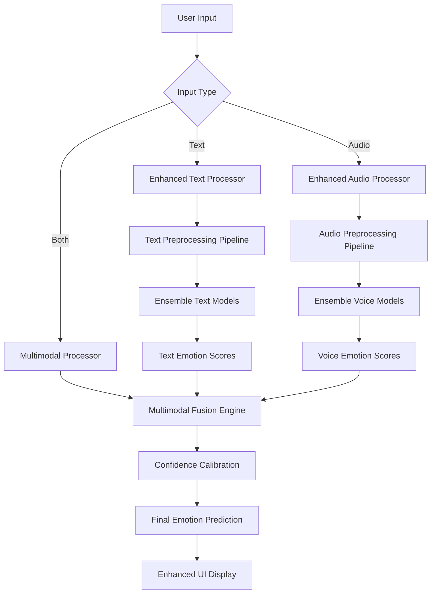

# Design Document

## Overview

This design document outlines the architecture and implementation strategy for enhancing emotion detection precision in the Emotion AI platform. The enhancement focuses on improving accuracy through advanced preprocessing, ensemble methods, multimodal fusion, and specialized model architectures for both text and voice emotion analysis.

The current system achieves ~85% accuracy for text emotions and ~75% for voice emotions. Our goal is to reach 90%+ for text and 85%+ for voice through systematic improvements in model architecture, data preprocessing, and fusion techniques.

## Architecture

### High-Level Architecture



### Core Components Architecture

#### 1. Enhanced Preprocessing Layer
- **Text Preprocessor**: Advanced text cleaning, normalization, and context enhancement
- **Audio Preprocessor**: Noise reduction, feature extraction, and quality assessment
- **Context Analyzer**: Situational and temporal context integration

#### 2. Model Ensemble Layer
- **Text Ensemble**: Multiple specialized text emotion models
- **Voice Ensemble**: Multiple voice emotion recognition models
- **Cross-Modal Validation**: Consistency checking between modalities

#### 3. Fusion and Calibration Layer
- **Multimodal Fusion Engine**: Intelligent combination of text and voice predictions
- **Confidence Calibration**: Uncertainty quantification and reliability scoring
- **Adaptive Weighting**: Dynamic adjustment based on input quality and context

## Components and Interfaces

### 1. Enhanced Emotion Analyzer

```python
class EnhancedEmotionAnalyzer:
    """Advanced emotion analyzer with ensemble methods and multimodal fusion"""
    
    def __init__(self, config: EmotionConfig):
        self.config = config
        self.text_ensemble = TextEmotionEnsemble(config.text_models)
        self.voice_ensemble = VoiceEmotionEnsemble(config.voice_models)
        self.fusion_engine = MultimodalFusionEngine(config.fusion_params)
        self.calibrator = ConfidenceCalibrator()
        
    def analyze_text(self, text: str, context: Dict = None) -> EmotionResult:
        """Enhanced text emotion analysis with ensemble methods"""
        
    def analyze_audio(self, audio: np.ndarray, context: Dict = None) -> EmotionResult:
        """Enhanced voice emotion analysis with ensemble methods"""
        
    def analyze_multimodal(self, text: str, audio: np.ndarray, context: Dict = None) -> EmotionResult:
        """Multimodal emotion analysis with fusion"""
```

### 2. Text Emotion Ensemble

```python
class TextEmotionEnsemble:
    """Ensemble of specialized text emotion models"""
    
    def __init__(self, model_configs: List[ModelConfig]):
        self.models = {
            'primary': BERTGoEmotionModel(),
            'roberta': RoBERTaEmotionModel(),
            'context_aware': ContextAwareEmotionModel(),
            'domain_specific': DomainSpecificModel(),
            'multilingual': MultilingualEmotionModel()
        }
        self.weights = self._calculate_model_weights()
        
    def predict(self, text: str, context: Dict = None) -> List[EmotionScore]:
        """Ensemble prediction with weighted voting"""
        
    def _calculate_model_weights(self) -> Dict[str, float]:
        """Dynamic weight calculation based on model performance"""
```

### 3. Voice Emotion Ensemble

```python
class VoiceEmotionEnsemble:
    """Ensemble of specialized voice emotion models"""
    
    def __init__(self, model_configs: List[ModelConfig]):
        self.models = {
            'wav2vec2': Wav2Vec2EmotionModel(),
            'hubert': HuBERTEmotionModel(),
            'spectral': SpectralEmotionModel(),
            'prosodic': ProsodicEmotionModel(),
            'dimensional': DimensionalEmotionModel()
        }
        self.feature_extractors = VoiceFeatureExtractors()
        
    def predict(self, audio: np.ndarray, context: Dict = None) -> List[EmotionScore]:
        """Ensemble prediction with feature-based weighting"""
```

### 4. Multimodal Fusion Engine

```python
class MultimodalFusionEngine:
    """Advanced fusion of text and voice emotion predictions"""
    
    def __init__(self, fusion_config: FusionConfig):
        self.fusion_strategies = {
            'weighted_average': WeightedAverageFusion(),
            'attention_based': AttentionBasedFusion(),
            'neural_fusion': NeuralFusionNetwork(),
            'bayesian_fusion': BayesianFusion()
        }
        self.conflict_resolver = ConflictResolver()
        
    def fuse_predictions(self, text_emotions: List[EmotionScore], 
                        voice_emotions: List[EmotionScore],
                        context: Dict = None) -> EmotionResult:
        """Intelligent fusion of multimodal predictions"""
```

### 5. Advanced Preprocessing Pipeline

```python
class AdvancedPreprocessor:
    """Enhanced preprocessing for both text and audio inputs"""
    
    def __init__(self):
        self.text_processor = EnhancedTextProcessor()
        self.audio_processor = EnhancedAudioProcessor()
        self.context_analyzer = ContextAnalyzer()
        
    def preprocess_text(self, text: str, metadata: Dict = None) -> ProcessedText:
        """Advanced text preprocessing with context awareness"""
        
    def preprocess_audio(self, audio: np.ndarray, metadata: Dict = None) -> ProcessedAudio:
        """Advanced audio preprocessing with quality enhancement"""
```

## Data Models

### Core Data Structures

```python
@dataclass
class EmotionScore:
    """Enhanced emotion score with metadata"""
    label: str
    score: float
    confidence: float
    source: str  # 'text', 'voice', 'fused'
    model_name: str
    processing_time: float
    metadata: Dict[str, Any]

@dataclass
class EmotionResult:
    """Comprehensive emotion analysis result"""
    primary_emotion: EmotionScore
    all_emotions: List[EmotionScore]
    confidence_level: str  # 'high', 'medium', 'low'
    uncertainty_score: float
    processing_metadata: ProcessingMetadata
    insights: List[str]
    recommendations: List[str]

@dataclass
class ProcessingMetadata:
    """Metadata about the analysis process"""
    input_quality: float
    models_used: List[str]
    processing_time: float
    fusion_strategy: str
    context_factors: Dict[str, Any]
    
@dataclass
class EmotionConfig:
    """Configuration for enhanced emotion analysis"""
    precision_level: str  # 'fast', 'balanced', 'high_precision'
    enable_ensemble: bool
    enable_multimodal: bool
    text_models: List[str]
    voice_models: List[str]
    fusion_strategy: str
    confidence_threshold: float
```

### Model Performance Tracking

```python
@dataclass
class ModelPerformance:
    """Track individual model performance"""
    model_name: str
    accuracy: float
    precision: float
    recall: float
    f1_score: float
    processing_time: float
    memory_usage: float
    last_updated: datetime

@dataclass
class EnsembleMetrics:
    """Track ensemble performance metrics"""
    overall_accuracy: float
    individual_models: List[ModelPerformance]
    fusion_effectiveness: float
    confidence_calibration: float
    bias_metrics: Dict[str, float]
```

## Error Handling

### Robust Error Management

```python
class EmotionAnalysisError(Exception):
    """Base exception for emotion analysis errors"""
    pass

class ModelLoadError(EmotionAnalysisError):
    """Error loading emotion models"""
    pass

class PreprocessingError(EmotionAnalysisError):
    """Error in preprocessing pipeline"""
    pass

class FusionError(EmotionAnalysisError):
    """Error in multimodal fusion"""
    pass

class ErrorHandler:
    """Centralized error handling with graceful degradation"""
    
    def __init__(self):
        self.fallback_models = FallbackModels()
        self.error_logger = ErrorLogger()
        
    def handle_model_failure(self, model_name: str, error: Exception) -> EmotionResult:
        """Handle individual model failures with fallbacks"""
        
    def handle_fusion_failure(self, text_result: EmotionResult, 
                            voice_result: EmotionResult) -> EmotionResult:
        """Handle fusion failures with degraded service"""
```

### Quality Assurance

```python
class QualityAssurance:
    """Quality checks and validation for emotion predictions"""
    
    def __init__(self):
        self.validators = [
            ConsistencyValidator(),
            BiasDetector(),
            ConfidenceValidator(),
            OutlierDetector()
        ]
        
    def validate_prediction(self, result: EmotionResult, 
                          input_data: Dict) -> ValidationResult:
        """Comprehensive validation of emotion predictions"""
        
    def detect_anomalies(self, results: List[EmotionResult]) -> List[Anomaly]:
        """Detect unusual patterns in emotion predictions"""
```

## Testing Strategy

### Comprehensive Testing Framework

#### 1. Unit Testing
- **Model Testing**: Individual model accuracy and performance
- **Preprocessing Testing**: Text and audio preprocessing validation
- **Fusion Testing**: Multimodal fusion algorithm validation
- **Error Handling Testing**: Graceful degradation scenarios

#### 2. Integration Testing
- **End-to-End Pipeline**: Complete emotion analysis workflow
- **API Integration**: External service integration testing
- **Database Integration**: Emotion logging and retrieval
- **UI Integration**: Frontend emotion display and interaction

#### 3. Performance Testing
- **Load Testing**: High-volume emotion analysis requests
- **Stress Testing**: System behavior under extreme conditions
- **Memory Testing**: Memory usage optimization validation
- **Latency Testing**: Response time optimization

#### 4. Accuracy Testing
- **Benchmark Datasets**: Standard emotion recognition datasets
- **Cross-Validation**: K-fold validation for model reliability
- **A/B Testing**: Comparison with current implementation
- **Human Evaluation**: Expert validation of emotion predictions

### Testing Implementation

```python
class EmotionTestSuite:
    """Comprehensive testing suite for emotion analysis"""
    
    def __init__(self):
        self.test_datasets = TestDatasets()
        self.benchmarks = EmotionBenchmarks()
        self.validators = HumanValidators()
        
    def run_accuracy_tests(self) -> AccuracyReport:
        """Run comprehensive accuracy testing"""
        
    def run_performance_tests(self) -> PerformanceReport:
        """Run performance and scalability testing"""
        
    def run_bias_tests(self) -> BiasReport:
        """Test for bias across demographic groups"""
        
    def run_robustness_tests(self) -> RobustnessReport:
        """Test model robustness to adversarial inputs"""
```

### Continuous Monitoring

```python
class EmotionMonitoring:
    """Real-time monitoring of emotion analysis performance"""
    
    def __init__(self):
        self.metrics_collector = MetricsCollector()
        self.alerting_system = AlertingSystem()
        self.dashboard = MonitoringDashboard()
        
    def monitor_accuracy(self) -> None:
        """Continuous accuracy monitoring"""
        
    def monitor_bias(self) -> None:
        """Continuous bias detection and alerting"""
        
    def monitor_performance(self) -> None:
        """Performance metrics monitoring"""
```

## Implementation Phases

### Phase 1: Enhanced Preprocessing (Weeks 1-2)
- Implement advanced text preprocessing with context awareness
- Develop enhanced audio preprocessing with noise reduction
- Create quality assessment metrics for input validation

### Phase 2: Model Ensemble Implementation (Weeks 3-4)
- Implement text emotion ensemble with multiple models
- Develop voice emotion ensemble with specialized models
- Create dynamic weighting system for ensemble predictions

### Phase 3: Multimodal Fusion (Weeks 5-6)
- Implement attention-based fusion mechanism
- Develop conflict resolution strategies
- Create adaptive weighting based on input quality

### Phase 4: Confidence Calibration (Week 7)
- Implement uncertainty quantification
- Develop confidence calibration algorithms
- Create reliability scoring system

### Phase 5: Testing and Optimization (Week 8)
- Comprehensive testing suite implementation
- Performance optimization and tuning
- Bias detection and mitigation

### Phase 6: Integration and Deployment (Week 9)
- Integration with existing Emotion AI platform
- User interface enhancements
- Documentation and training materials

This design provides a comprehensive framework for significantly improving emotion detection precision through advanced machine learning techniques, ensemble methods, and multimodal fusion while maintaining system reliability and user experience.