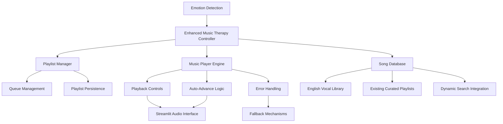
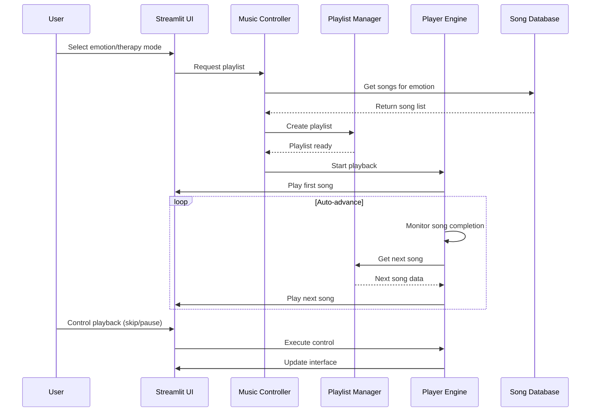

# Design Document

## Overview

The Enhanced Music Playback feature extends the existing music therapy system to support continuous multi-song playback and enriched English vocal music libraries. The design builds upon the current `EnhancedMusicTherapy` class and integrates with the existing emotion detection pipeline to provide seamless, therapeutic music experiences.

The system will maintain the current therapeutic focus while adding playlist management, continuous playback controls, and an expanded English song database with popular vocal tracks. The architecture ensures backward compatibility with existing functionality while providing enhanced user experience through automated playlist progression and richer music variety.

## Architecture

### High-Level Architecture



### Component Interaction Flow



## Components and Interfaces

### 1. Enhanced Music Controller

**Purpose**: Central orchestrator for music therapy sessions with multi-song support.

**Key Methods**:
- `create_continuous_session(emotion, mode, song_count)`: Creates multi-song therapy sessions
- `get_enhanced_english_playlist(emotion, count)`: Returns vocal-rich English playlists
- `handle_playback_control(action, playlist_position)`: Manages play/pause/skip controls
- `auto_advance_playlist()`: Handles automatic song progression

**Interface**:
```python
class EnhancedMusicController:
    def __init__(self):
        self.playlist_manager = PlaylistManager()
        self.player_engine = PlayerEngine()
        self.song_database = EnhancedSongDatabase()
    
    def create_continuous_session(self, emotion: str, mode: str, song_count: int) -> Playlist
    def get_enhanced_english_playlist(self, emotion: str, count: int) -> List[Song]
    def handle_playback_control(self, action: str, position: int) -> PlaybackState
```

### 2. Playlist Manager

**Purpose**: Manages playlist creation, modification, and persistence.

**Key Methods**:
- `create_playlist(songs, metadata)`: Creates new playlist with therapeutic metadata
- `add_song(playlist_id, song, position)`: Adds songs to existing playlists
- `remove_song(playlist_id, position)`: Removes songs from playlists
- `save_playlist(playlist, user_id)`: Persists playlists for future use
- `load_saved_playlists(user_id)`: Retrieves user's saved playlists

**Interface**:
```python
@dataclass
class Playlist:
    id: str
    name: str
    songs: List[Song]
    emotion_focus: str
    created_at: datetime
    therapeutic_notes: str
    total_duration: int

class PlaylistManager:
    def create_playlist(self, songs: List[Song], metadata: Dict) -> Playlist
    def modify_playlist(self, playlist_id: str, action: str, **kwargs) -> Playlist
    def save_playlist(self, playlist: Playlist) -> bool
```

### 3. Player Engine

**Purpose**: Handles audio playback, auto-advancement, and error recovery.

**Key Methods**:
- `play_song(song, auto_advance=True)`: Plays individual songs with auto-advance option
- `monitor_playback()`: Monitors song completion for auto-advancement
- `handle_playback_error(error, song)`: Manages playback failures gracefully
- `update_playback_state(state)`: Updates current playback status

**Interface**:
```python
@dataclass
class PlaybackState:
    current_song: Optional[Song]
    playlist_position: int
    is_playing: bool
    auto_advance: bool
    error_count: int
    last_error: Optional[str]

class PlayerEngine:
    def play_song(self, song: Song, auto_advance: bool = True) -> bool
    def monitor_playback(self) -> PlaybackState
    def handle_error(self, error: Exception, song: Song) -> bool
```

### 4. Enhanced Song Database

**Purpose**: Expanded song library with rich English vocal content and improved categorization.

**Key Features**:
- Expanded English vocal music library with popular artists
- Improved emotion-to-song mapping with vocal/instrumental balance
- Song metadata including lyrics themes, energy levels, and therapeutic benefits
- Content filtering for appropriate therapeutic material

**Interface**:
```python
@dataclass
class EnhancedSong(Song):
    has_vocals: bool
    lyrics_theme: str
    energy_level: int  # 1-10 scale
    therapeutic_benefits: List[str]
    content_rating: str  # clean, explicit, etc.
    popularity_score: int

class EnhancedSongDatabase:
    def get_vocal_songs_for_emotion(self, emotion: str, count: int) -> List[EnhancedSong]
    def get_mixed_playlist(self, emotion: str, vocal_ratio: float) -> List[EnhancedSong]
    def filter_content(self, songs: List[EnhancedSong], rating: str) -> List[EnhancedSong]
```

## Data Models

### Enhanced Song Model

```python
@dataclass
class EnhancedSong:
    # Existing fields
    title: str
    artist: str
    url: str
    duration: int
    genre: str
    mood: str
    preview_url: Optional[str] = None
    thumbnail: Optional[str] = None
    description: Optional[str] = None
    
    # New fields for enhanced functionality
    has_vocals: bool = True
    lyrics_theme: str = ""
    energy_level: int = 5  # 1-10 scale
    therapeutic_benefits: List[str] = field(default_factory=list)
    content_rating: str = "clean"
    popularity_score: int = 50  # 1-100 scale
    language: str = "english"
    release_year: Optional[int] = None
```

### Playlist Model

```python
@dataclass
class TherapeuticPlaylist:
    id: str
    name: str
    songs: List[EnhancedSong]
    emotion_focus: str
    secondary_emotions: List[str]
    created_at: datetime
    therapeutic_notes: str
    total_duration: int
    vocal_instrumental_ratio: float
    user_customized: bool = False
    play_count: int = 0
    user_rating: Optional[int] = None
```

### Playback Session Model

```python
@dataclass
class PlaybackSession:
    session_id: str
    playlist: TherapeuticPlaylist
    current_position: int
    playback_state: PlaybackState
    start_time: datetime
    user_interactions: List[Dict]  # skip, pause, etc.
    completion_rate: float
    therapeutic_feedback: Optional[str] = None
```

## Error Handling

### Playback Error Recovery

1. **Song Loading Failures**:
   - Automatic skip to next song after 10-second timeout
   - Log failed song for future debugging
   - Notify user only if multiple consecutive failures occur

2. **Network Connectivity Issues**:
   - Implement retry logic with exponential backoff
   - Provide offline mode with cached/local content
   - Display clear connectivity status to user

3. **Playlist Exhaustion**:
   - Offer to repeat playlist or generate new one
   - Suggest related playlists based on current emotion
   - Maintain session continuity with smooth transitions

### Error Logging and Monitoring

```python
class PlaybackErrorHandler:
    def handle_song_error(self, song: EnhancedSong, error: Exception) -> bool
    def handle_network_error(self, error: Exception) -> bool
    def log_error(self, error_type: str, details: Dict) -> None
    def get_error_statistics(self) -> Dict
```

## Testing Strategy

### Unit Testing

1. **Playlist Manager Tests**:
   - Playlist creation with various emotion combinations
   - Song addition/removal operations
   - Playlist persistence and retrieval

2. **Player Engine Tests**:
   - Auto-advance functionality
   - Error handling and recovery
   - Playback state management

3. **Song Database Tests**:
   - English vocal song filtering
   - Content rating enforcement
   - Emotion-based song selection

### Integration Testing

1. **End-to-End Playback Flow**:
   - Complete therapy session from emotion detection to playlist completion
   - User interaction scenarios (skip, pause, replay)
   - Error recovery during active sessions

2. **Cross-Component Integration**:
   - Emotion detection → playlist generation → playback
   - User customization → playlist modification → persistence
   - Error handling across all components

### Performance Testing

1. **Playlist Generation Speed**:
   - Large playlist creation (20+ songs)
   - Multiple concurrent users
   - Database query optimization

2. **Memory Usage**:
   - Long-running playback sessions
   - Multiple active playlists
   - Audio buffer management

## Implementation Phases

### Phase 1: Core Multi-Song Playback
- Extend existing `EnhancedMusicTherapy` class
- Implement basic auto-advance functionality
- Add playlist management capabilities

### Phase 2: Enhanced English Song Library
- Expand song database with popular vocal tracks
- Implement content filtering and categorization
- Add therapeutic metadata to songs

### Phase 3: Advanced Playlist Features
- User customization and playlist editing
- Playlist persistence and sharing
- Advanced error handling and recovery

### Phase 4: User Experience Enhancements
- Improved UI controls and feedback
- Session analytics and recommendations
- Performance optimizations